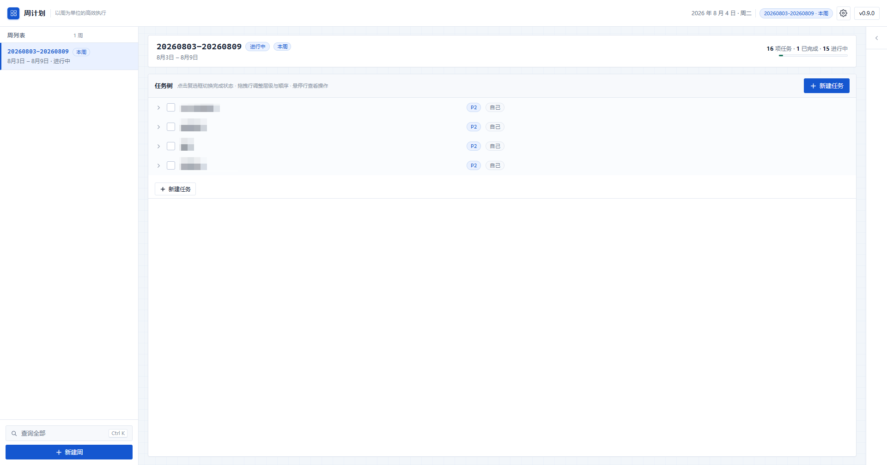
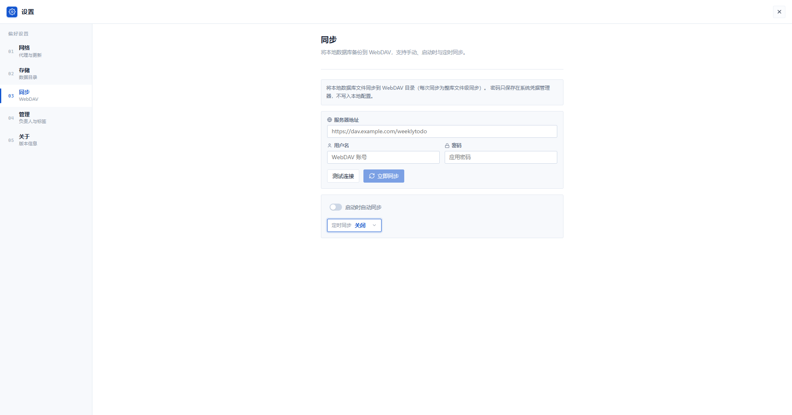

# 周计划（weeklytodo）

本地优先的 Windows 周任务树应用。以「周」为第一层级管理任务：每周一为新的周期，上周未完成的任务树自动带入本周，全部历史数据保存在你选择的本机目录（SQLite）。

## 亮点

### 以周为单位的智能任务流转

每周一自动创建新周期，上周未完成的任务树完整带入本周，父-子结构保持不变；已完成的分支自动清除，只保留真正需要继续推进的工作。几周未打开应用也不用担心——启动时自动从最近一周带入未完成内容，避免数据丢失。



### 无限层级任务树

支持任意深度的任务嵌套，通过拖拽自由调整层级与顺序。每个任务可设置优先级（P0-P3）、执行方式（自己执行 / 需要跟进）、负责人、分派人和标签，满足从个人待办到团队协作的各种场景。


### 当前行动面板

自动提取本周所有可执行的叶子任务，一眼看清当前该做什么。点击即可标记完成，专注于当下而非被整棵树分散注意力。

### 全历史查询

左侧只展示最近 4 周保持界面清爽，点击「查询全部」可按关键词、状态、是否带入、负责人、分派人、标签等条件检索所有历史周的任务，点击结果直接跳转到对应周。

### 本地优先 · 隐私安全

所有数据保存在本机 SQLite 数据库，不依赖任何云服务。支持自选数据目录，迁移时自动备份原文件。WebDAV 同步可选开启，密码通过 Windows 系统凭据库安全存储。



### 自动更新

集成 GitHub Release，应用内一键检查更新。语义化版本比较，下载后等待应用退出再启动安装器，更新过程无感。

### 现代技术栈

- **前端**：React 19 + TypeScript + Rsbuild + Ant Design
- **桌面壳**：Tauri 2（Rust）— 体积小、启动快、内存占用低
- **存储**：SQLite（rusqlite + bundled）— 零配置、单文件、WAL 模式
- **打包**：NSIS 当前用户安装器，支持 Windows 10+

## 核心概念

- **周为第一层级**：每周标识形如 `20260803-20260809`（周一至周日）。
- **自动建周**：每次启动检查是否需要创建当前周；如果几周未打开，从最近存储的一周带入未完成工作，避免数据丢失。
- **带入未完成分支**：未完成的任务树整体复制到新周（父-子结构保持不变）；分支内已完成节点作为只读上下文保留；完全完成的分支不带入。
- **手动创建**：可手动为指定周一创建新周，重复周会被拒绝。
- **数据查询**：左侧只展示最近 4 周；「查询全部」面板可按周范围、关键词、状态、是否带入筛选所有历史周的任务，点击结果可直接定位到对应周。
- **默认数据目录**：首次运行选择数据目录，之后可在设置中迁移（迁移前自动备份，原文件保留）。

## 技术栈

- 前端：React 19 + TypeScript + Rsbuild + Ant Design（参考 PrintAssist 技术栈）
- 桌面壳：Tauri 2（Rust），SQLite（rusqlite + bundled SQLite）
- 打包：NSIS 当前用户安装器
- 自动更新：GitHub Release（语义化版本比较），下载后等待应用退出再启动安装器

## 开发

```bash
npm install
npm run tauri:dev
```

## 测试

```bash
npm run lint          # 前端类型检查
npm test              # 前端测试（如已添加）
cd src-tauri && cargo test   # Rust 单元测试（周计算、带入、迁移等）
```

## 打包与发布

```bash
npm run tauri:build   # 生成 NSIS 安装器
```

打 `v*` 标签推送到 GitHub 后，[release.yml](.github/workflows/release.yml) 会自动构建并把安装器发布到 GitHub Release；应用内「检查更新」会从最新 Release 获取安装包。

### 预热 Rust 编译缓存（可选，推荐发版前执行）

GitHub Actions 的缓存按分支 / 标签隔离：Release 工作流由 `v*` 标签触发，只能读取该标签和默认分支（main）上的缓存。为了让发版时跳过 Rust 依赖的全量编译（约 7 分钟），发版前先在 main 上预热一次：

```bash
gh workflow run warm-cache.yml
```

首次执行是全量编译（约 8 分钟，一次性成本），之后执行会恢复已有缓存并增量编译，通常 1 分钟内完成。依赖变更后需重新预热。发版时 [release.yml](.github/workflows/release.yml) 会自动命中该缓存，将整体打包时间从约 8 分钟降至约 2~3 分钟。

## 友联

[LINUX DO - 新的理想型社区](https://linux.do/)
